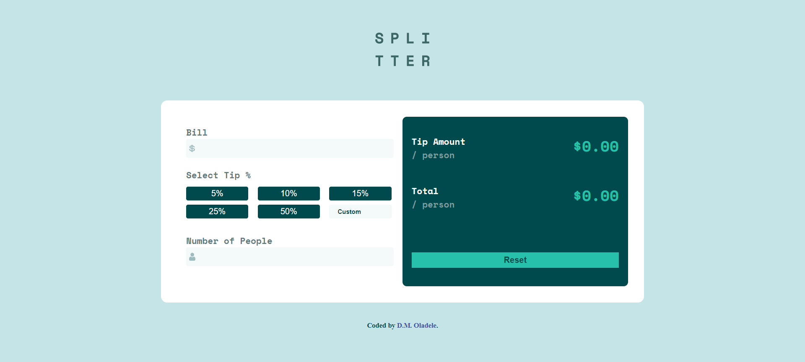

- [Overview](#overview)
  - [The challenge](#the-challenge)
  - [Screenshot](#screenshot)
  - [Links](#links)
- [My process](#my-process)
  - [Built with](#built-with)
  - [What I learned](#what-i-learned)
  - [Continued development](#continued-development)
  - [Useful resources](#useful-resources)
- [Author](#author)

## Overview

### The challenge
Users should be able to:

- View the optimal layout for the app depending on their device's screen size
- See hover states for all interactive elements on the page
- Calculate the correct tip and total cost of the bill per person

### Screenshot

### Links

- Solution URL: [https://github.com/activus-d/tip-calculator-app-main/edit/master/README.md](https://github.com/activus-d/tip-calculator-app-main/edit/master/README.md)
- Live Site URL: [https://activus-d.github.io/tip-calculator-app-main/](https://activus-d.github.io/tip-calculator-app-main/)

## My process

### Built with
- Semantic HTML5 markup
- CSS custom properties
- Flexbox
- Vanilla JavaScript

### What I learned
- learned how to use keypress enter event

### Continued development
- Need to continue mastering page responsiveness
- Need to master how to use the class functions and OOP

### Useful resources
- [w3schools](https://www.w3schools.com/howto/tryit.asp?filename=tryhow_js_trigger_button_enter) - This helped me learn how to use keypress enter for event

## Author

- Blog - [D.M. Oladele](https://activuscode.hashnode.dev/)
- Twitter - [@activus_d](https://twitter.com/activus_d)
